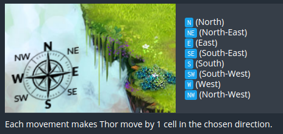

### The Goal
Your program must allow Thor to reach the light of power. You need to have the shortest code possible.

#### Rules
Thor moves on a map which is 40 wide by 18 high. Note that the coordinates (X and Y) start at the top left! This means the most top left cell has the coordinates "X=0,Y=0" and the most bottom right one has the coordinates "X=39,Y=17".

Once the program starts you are given:
the variable lightX: the X position of the light of power that Thor must reach.
the variable lightY: the Y position of the light of power that Thor must reach.
the variable initialTX: the starting X position of Thor.
the variable initialTY: the starting Y position of Thor.
At the end of the game turn, you must output the direction in which you want Thor to go among:

<pre>
Victory Conditions
You win when Thor reaches the light of power
</pre>
<pre>
Lose Conditions
Thor moves outside the map
</pre>

#### Game Input
The program must first read the initialization data from the standard input, then, in an infinite loop, provides on the standard output the instructions to move Thor.

#### Initialization input
- Line 1: 4 integers <b>lightX lightY initialTX initialTY</b>. (lightX, lightY) indicates the position of the light. (initialTX, initialTY) indicates the initial position of Thor.

#### Input for a game round
- Line 1: the number of remaining moves for Thor to reach the light of power: <b>remainingTurns</b>. You can ignore this data but you must read it.

#### Output for a game round
- A single line providing the move to be made: <b>N NE E SE S SW W</b> or <b>NW</b>

#### Constraints
- 0 ≤ <b>lightX</b> < 40
- 0 ≤ <b>lightY</b> < 18
- 0 ≤ <b>initialTX</b> < 40
- 0 ≤ <b>initialTY</b> < 18
- Response time for a game round ≤ 100ms