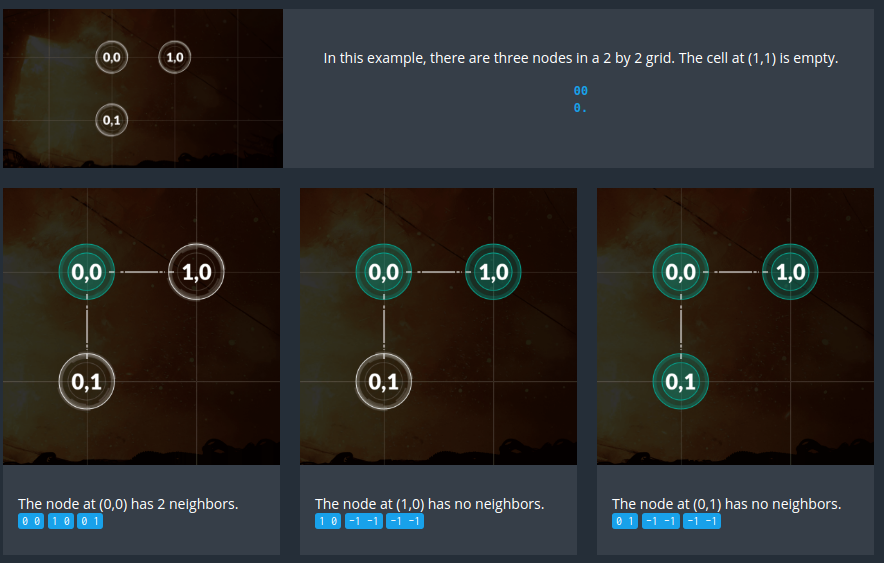

#### The Goal
The game is played on a rectangular grid with a given size. Some cells contain power nodes. The rest of the cells are empty.

The goal is to find, when they exist, the horizontal and vertical neighbors of each node.
#### Rules
To do this, you must find each (x1,y1) coordinates containing a node, and display the (x2,y2) coordinates of the next node to the right, and the (x3,y3) coordinates of the next node to the bottom within the grid.

If a neighbor does not exist, you must output the coordinates -1 -1 instead of (x2,y2) and/or (x3,y3).

You lose if:
You give an incorrect neighbor for a node.
You give the neighbors for an empty cell.
You compute the same node twice.
You forget to compute the neighbors of a node.

<pre>
<b>Victory Conditions</b>
You win when all nodes have been correctly displayed.
</pre>
#### Example 

#### Game Input
The program must first read the initialization data from standard input. Then, provide to the standard output one line per instruction.
##### Initialization input
- Line 1: one integer <b>width</b> for the number of cells along the x axis.

- Line 2: one integer <b>height</b> for the number of cells along the y axis.

- Next <b>height</b> lines: A string  <b>line</b>  containing  <b>width</b>  characters. A dot '.' represents an empty cell. A zero '0' represents a cell containing a node.

##### Output for one game turn
- One line per node. Six integers on each line:   <b>x1  y1  x2  y2  x3  y3</b>

Where:

- (x1,y1) the coordinates of a node
- (x2,y2) the coordinates of the closest neighbor on the right of the node
- (x3,y3) the coordinates of the closest bottom neighbor

If there is no neighbor, the coordinates should be "-1 -1".

##### Constraints
- 0 < <b>width</b> ≤ 30
- 0 < <b>height</b> ≤ 30
- 0 ≤ x1 < <b>width</b>
- 0 ≤ y1 < <b>height</b>
- -1 ≤ x2, x3 < <b>width</b>
- -1 ≤ y2, y3 < <b>height</b>
- Alloted response time to first output line ≤ 1s.
- Response time between two output lines ≤ 100ms
